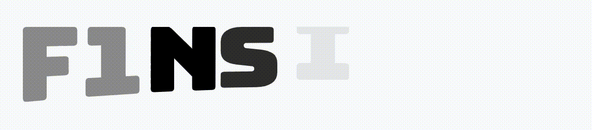

# Animify: AI-Powered SVG Animation Generator




Animify is an innovative web application that transforms static SVG files into dynamic, meaningful animations using Claude Sonnet 3.7. Upload your layered SVG, and let Claude analyze its components to create semantically appropriate animations that bring your graphics to life.

## Project Overview

Static SVGs are everywhere in modern web design, but animating them typically requires specialized skills in animation and coding. Animify bridges this gap by using Claude Sonnet 3.7 to understand what each element in your SVG represents and how it should move naturally.

The application analyzes your SVG's structure, identifies individual layers, and suggests animations that make sense for each element—whether it's a bird that should fly, a wave that should undulate, or text that should fade in at just the right moment.

## Features

### AI-Powered Analysis

* **Semantic Understanding**: Claude Sonnet 3.7 analyzes your SVG to understand what each element represents
* **Intelligent Grouping**: Identifies elements that should be animated together
* **Animation Suggestions**: Recommends appropriate animations based on element type and meaning

### SVG Processing

* **Layer Extraction**: Automatically separates your SVG into individual layers
* **Element Classification**: Categorizes elements as primary, secondary, text, or background
* **Visual Preview**: See your SVG structure before animation

### Animation Generation

* **Custom Animation Code**: Generates tailored animation code using anime.js or Animate.css
* **Semantic Animations**: Creates movements that reflect the real-world behavior of elements
* **Sequenced Timing**: Properly times and sequences animations for a professional look

### Customization Options

* **Code Editing**: Directly modify the generated animation code
* **Analysis Refinement**: Adjust the AI's analysis to fine-tune animation concepts
* **Animation Preview**: Test animations before finalizing

## Claude Sonnet 3.7 Integration

Animify uses Claude Sonnet 3.7 via the Anthropic API at multiple stages of the animation process:

### SVG Analysis

When you upload an SVG, Claude Sonnet 3.7 analyzes each layer to:

1. **Identify visual elements**: Recognizes what each shape or path represents (e.g., "mountain", "bird", "company name")
2. **Classify importance**: Determines whether elements are primary focal points, secondary elements, text, or background
3. **Suggest animation approaches**: Recommends how each element should move based on what it represents

```json
{
  "elements": [
    {
      "id": "layer-bird",
      "type": "primary",
      "description": "A stylized bird with wings spread",
      "animationSuggestion": "Fly in from left to right with gentle wing movement"
    }
    // Additional elements...
  ],
  "groupings": [
    {
      "name": "sky-elements",
      "elementIds": ["layer-bird", "layer-clouds"],
      "reason": "These elements belong to the sky and should move in harmony"
    }
  ],
  "conceptDescription": "Overall animation concept that would be semantically meaningful for this logo"
}
```

### Animation Generation

Based on the analysis, Claude Sonnet 3.7 generates custom animation code that:

1. **Matches semantics**: Creates movements that reflect what elements represent
2. **Sequences properly**: Ensures elements animate in a logical order
3. **Uses appropriate techniques**: Selects suitable animation methods from anime.js or Animate.css
4. **Includes documentation**: Adds comments explaining the animation approach

```javascript
// Animation code generated by Claude Sonnet 3.7
function animateLogo() {
  // Animate the bird (primary element) with a flying motion
  anime({
    targets: '#layer-bird',
    translateX: [-100, 0],
    translateY: [20, 0],
    opacity: [0, 1],
    easing: 'easeOutQuad',
    duration: 1200
  });
  
  // Additional animation code...
}
```

### Conceptual Description

Claude Sonnet 3.7 provides a written explanation of the animation approach, helping users understand the creative decisions behind the generated animations.

## Technical Stack

* **Frontend**: React, Next.js, TypeScript, Tailwind CSS
* **Animation Libraries**: anime.js, Animate.css
* **AI Integration**: Claude Sonnet 3.7 via Anthropic API
* **Styling**: shadcn/ui component library

## Usage Examples

If you don't have any, you can download the Gary logo [here](assets/Gary.svg).

### Example 1: Logo Animation

The "Gary" logo animation demonstrates how Animify can take a simple logo and create a playful, engaging animation that reflects the character's personality:


### Example 2: Text Animation

The F1nsight animation shows how Animify handles more complex SVGs with multiple elements, creating a cohesive animation that brings the racing theme to life:


## How to Use Animify

1. **Upload Your SVG**

   * Export a layered SVG from your design tool (Figma, Illustrator, etc.)
   * Ensure layers have meaningful names and IDs
   * Upload the SVG to Animify

2. **Review the Analysis**

   * Examine how Claude has interpreted your SVG elements
   * Review the suggested animation concepts
   * Make adjustments to the analysis if needed

3. **Generate Animation**

   * Click "Generate Animation" to have Claude create the animation code
   * Preview the animation in the browser
   * Make adjustments to the code if desired

## Getting Started

### Prerequisites

* Node.js 16.x or higher
* An Anthropic API key for Claude Sonnet 3.7

### Installation

1. Clone the repository:

   ```bash
   git clone https://github.com/adityakotha03/LogoAnimation.git
   cd animify
   ```

2. Install dependencies:

   ```bash
   npm install
   ```

3. Set up environment variables:

   ```env
   CLAUDE_API_KEY=your_anthropic_api_key
   ```

4. Start the development server:

   ```bash
   npm run dev
   ```

5. Open [http://localhost:3000](http://localhost:3000) in your browser

## Future Enhancements

* Export preview as MP4
* Self-correct animation errors using Claude Vision
* Connect to music software (e.g., FL Studio) via MCP tools for synchronized beat drops

## Acknowledgments

* **Claude Sonnet 3.7**: Powered by Anthropic's Claude AI for intelligent SVG analysis and animation generation

---

## License

This project is licensed under the MIT License - see the LICENSE file for details.
